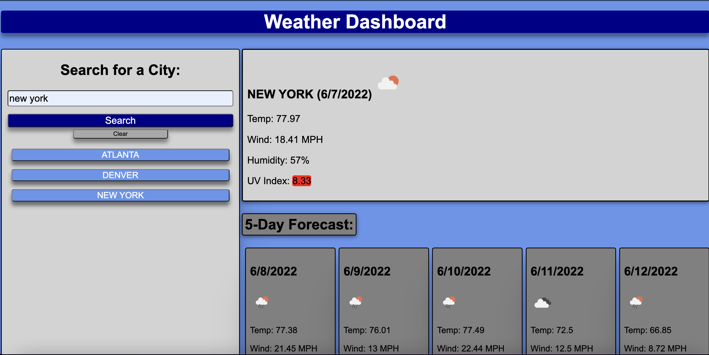

# Weather Dashboard

This application allows the user to input a city and view the current weather as well as the forecast for the next five days. It also stores the previously used cities to be selected and viewed again.

## Demo

https://wtguenthner.github.io/Weather_Dashboard/

## Screenshots

## Lessons Learned

This project required an understanding of APIs and how to fetch them according to the documentation given by the API site. Navigating through the API database to find the correct values needed was key as well.
Creating a local storage file to produce previously used inputs was also necessary in completing this project.

## 🔗 Links

